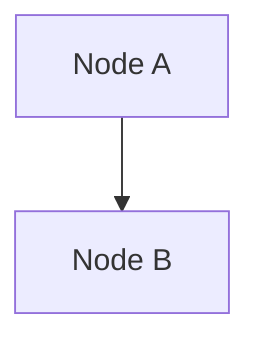
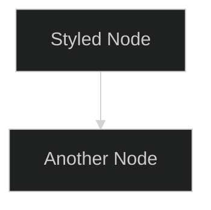

# 📊 Mermaid Diagram Generator for AI Interview System

A comprehensive collection of Mermaid diagram generators for creating professional documentation diagrams for the AI Interview System project.

## 🚀 Features

### Core Generators
- **System Architecture** - Complete system overview
- **User Flow Diagrams** - User journey mapping
- **Database Schema** - ER diagrams for data models
- **API Endpoints** - REST API documentation
- **Interview Process** - Sequence diagrams for AI interviews
- **Deployment Architecture** - Infrastructure diagrams
- **Application States** - State transition diagrams
- **Class Diagrams** - Object-oriented design
- **Component Architecture** - System components
- **Project Timeline** - Development roadmap
- **Git Workflow** - Version control flow

### Custom Specialized Diagrams
- **Security Flow** - Authentication & authorization
- **AI Processing Flow** - Machine learning pipeline
- **Data Flow** - Information flow through system
- **Error Handling** - Exception management
- **Performance Monitoring** - System metrics
- **Backup & Recovery** - Data protection strategy
- **Testing Strategy** - QA and testing approach

### Templates & Tools
- **Reusable Templates** - For custom diagram creation
- **Interactive CLI** - User-friendly interface
- **Batch Generation** - Generate all diagrams at once

## 📁 File Structure

```
documentation_codes/
├── mermaid_generator.py      # Main generator with core diagrams
├── interactive_generator.py  # CLI interface for selective generation
├── custom_diagrams.py       # Specialized advanced diagrams
├── diagram_templates.py     # Reusable templates
├── README.md               # This documentation
└── diagrams/               # Generated diagram files (created automatically)
    ├── system_architecture.md
    ├── user_flow.md
    ├── database_schema.md
    └── ... (all generated diagrams)
```

## 🛠️ Installation & Setup

### Prerequisites
- Python 3.7+
- No external dependencies required (uses only standard library)

### Quick Start
1. Navigate to the documentation_codes folder
2. Run any of the generator scripts

## 📖 Usage Guide

### 1. Generate All Diagrams (Recommended)
```bash
python mermaid_generator.py
```
This generates all core diagrams in one go.

### 2. Interactive Mode
```bash
python interactive_generator.py
```
Provides a menu-driven interface to generate specific diagrams.

### 3. Custom Specialized Diagrams
```bash
python custom_diagrams.py
```
Generates advanced technical diagrams for specialized documentation.

### 4. Using Templates for Custom Diagrams
```python
from diagram_templates import DiagramTemplates

# Create custom flowchart
nodes = {"A": "Start", "B": "Process", "C": "End"}
connections = [("A", "B"), ("B", "C")]
diagram = DiagramTemplates.flowchart_template("My Flow", nodes, connections)
```

## 📊 Available Diagram Types

### Core System Diagrams

#### 1. System Architecture
- **Purpose**: High-level system overview
- **Shows**: Frontend, backend, database, external services
- **Use Case**: Technical documentation, system design

#### 2. User Flow
- **Purpose**: User journey mapping
- **Shows**: Registration, login, dashboard navigation
- **Use Case**: UX documentation, user stories

#### 3. Database Schema
- **Purpose**: Data model relationships
- **Shows**: Tables, relationships, constraints
- **Use Case**: Database documentation, development reference

#### 4. API Endpoints
- **Purpose**: REST API structure
- **Shows**: Endpoints, request flow, services
- **Use Case**: API documentation, integration guide

#### 5. Interview Process
- **Purpose**: AI interview workflow
- **Shows**: Question generation, evaluation, feedback
- **Use Case**: Business process documentation

### Advanced Technical Diagrams

#### 6. Security Flow
- **Purpose**: Authentication & authorization
- **Shows**: Login process, role-based access, security checks
- **Use Case**: Security documentation, compliance

#### 7. AI Processing Flow
- **Purpose**: Machine learning pipeline
- **Shows**: Data preprocessing, AI calls, response handling
- **Use Case**: Technical architecture, AI documentation

#### 8. Performance Monitoring
- **Purpose**: System monitoring strategy
- **Shows**: Metrics collection, analysis, alerting
- **Use Case**: Operations documentation, monitoring setup

## 🎨 Customization

### Creating Custom Diagrams

1. **Using Templates**:
```python
from diagram_templates import DiagramTemplates

# Flowchart
diagram = DiagramTemplates.flowchart_template(
    title="My Process",
    nodes={"start": "Begin", "end": "Finish"},
    connections=[("start", "end", "process")]
)
```

2. **Extending Generators**:
```python
from mermaid_generator import MermaidGenerator

class MyCustomGenerator(MermaidGenerator):
    def generate_my_diagram(self):
        diagram = """
        graph TD
            A[My Custom Node] --> B[Another Node]
        """
        self.save_diagram("my_custom_diagram", diagram)
```

### Modifying Existing Diagrams

1. Open the relevant generator file
2. Find the diagram method (e.g., `generate_system_architecture`)
3. Modify the Mermaid syntax
4. Run the generator to create updated diagram

## 📋 Output Format

All diagrams are saved as Markdown files with embedded Mermaid code:

```markdown
# Diagram Title


```

## 🔧 Integration with Documentation

### GitHub/GitLab
- Copy Mermaid code directly into README.md files
- GitHub and GitLab render Mermaid diagrams automatically

### Mermaid Live Editor
1. Visit [mermaid.live](https://mermaid.live)
2. Paste the Mermaid code
3. Export as PNG/SVG for presentations

### Documentation Tools
- **GitBook**: Native Mermaid support
- **Notion**: Use Mermaid blocks
- **Confluence**: Mermaid macro available
- **Docusaurus**: Built-in Mermaid plugin

## 🎯 Best Practices

### Diagram Design
1. **Keep it Simple**: Focus on key components
2. **Consistent Naming**: Use clear, descriptive labels
3. **Logical Flow**: Left-to-right or top-to-bottom
4. **Color Coding**: Use subgraphs for grouping
5. **Documentation**: Add comments in Mermaid code

### File Organization
1. **Separate Concerns**: Different files for different diagram types
2. **Version Control**: Track diagram changes in Git
3. **Naming Convention**: Use descriptive filenames
4. **Regular Updates**: Keep diagrams current with code

### Team Collaboration
1. **Standardize Templates**: Use consistent styles
2. **Review Process**: Include diagrams in code reviews
3. **Documentation**: Link diagrams to relevant code
4. **Training**: Ensure team knows Mermaid syntax

## 🔍 Troubleshooting

### Common Issues

#### Diagram Not Rendering
- Check Mermaid syntax for errors
- Ensure proper indentation
- Validate on mermaid.live

#### File Not Generated
- Check file permissions
- Ensure output directory exists
- Verify Python script execution

#### Syntax Errors
- Use Mermaid documentation for reference
- Test complex diagrams incrementally
- Use online validator tools

### Getting Help

1. **Mermaid Documentation**: [mermaid-js.github.io](https://mermaid-js.github.io/)
2. **Live Editor**: [mermaid.live](https://mermaid.live)
3. **GitHub Issues**: Report bugs or request features
4. **Community**: Stack Overflow with 'mermaid' tag

## 🚀 Advanced Usage

### Batch Processing
```bash
# Generate all core diagrams
python mermaid_generator.py

# Generate all custom diagrams
python custom_diagrams.py

# Interactive selection
python interactive_generator.py
```

### Automation
```bash
# Add to CI/CD pipeline
python mermaid_generator.py
git add diagrams/
git commit -m "Update documentation diagrams"
```

### Custom Styling


## 📈 Future Enhancements

- [ ] **Web Interface**: Browser-based diagram generator
- [ ] **Real-time Preview**: Live Mermaid rendering
- [ ] **Export Options**: Direct PNG/SVG export
- [ ] **Template Library**: More reusable templates
- [ ] **Integration**: IDE plugins and extensions
- [ ] **Collaboration**: Multi-user diagram editing
- [ ] **Version Control**: Diagram diff and merge tools

## 🤝 Contributing

1. Fork the repository
2. Create a feature branch
3. Add new diagram generators or templates
4. Test thoroughly
5. Submit a pull request

### Adding New Diagrams

1. Create method in appropriate generator class
2. Follow existing naming conventions
3. Add to menu in interactive generator
4. Update documentation
5. Test generation and rendering

## 📄 License

This project is part of the AI Interview System and follows the same license terms.

## 🙏 Acknowledgments

- **Mermaid.js**: For the excellent diagramming syntax
- **AI Interview System Team**: For the comprehensive project requirements
- **Open Source Community**: For inspiration and best practices

---

**Made with ❤️ for better documentation and clearer communication**

---

## 📞 Support

For questions or issues:
1. Check this README first
2. Review the generated diagram files
3. Test on mermaid.live
4. Create an issue with details

**Happy Diagramming! 🎨📊**