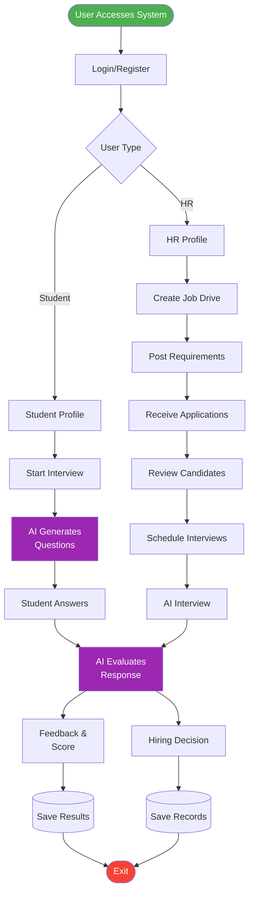

# Complete Working Flow

```mermaid
flowchart TD
    Start([User Accesses System]) --> Login[Login/Register]
    Login --> Type{User Type}
    
    Type -->|Student| SP[Student Profile]
    Type -->|HR| HP[HR Profile]
    
    SP --> SI[Start Interview]
    SI --> Gen[AI Generates<br/>Questions]
    Gen --> Ans[Student Answers]
    Ans --> Eval[AI Evaluates<br/>Response]
    Eval --> Feed[Feedback &<br/>Score]
    Feed --> Save1[(Save Results)]
    
    HP --> Job[Create Job Drive]
    Job --> Post[Post Requirements]
    Post --> Apps[Receive Applications]
    Apps --> Rev[Review Candidates]
    Rev --> Sch[Schedule Interviews]
    Sch --> AIInt[AI Interview]
    AIInt --> Eval
    Eval --> Dec[Hiring Decision]
    Dec --> Save2[(Save Records)]
    
    Save1 --> End([Exit])
    Save2 --> End
    
    style Start fill:#4CAF50,color:#fff
    style Gen fill:#9C27B0,color:#fff
    style Eval fill:#9C27B0,color:#fff
    style End fill:#F44336,color:#fff
```
