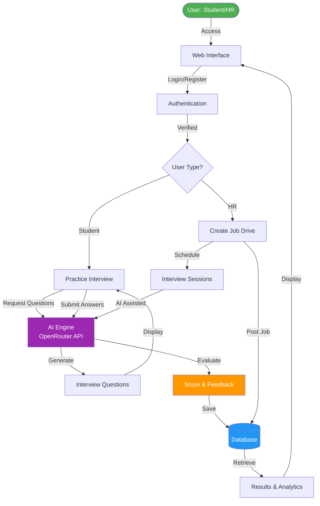

# Compressed Proposed System

```mermaid
flowchart TB
    User([User: Student/HR]) -->|Access| Web[Web Interface]
    
    Web -->|Login/Register| Auth[Authentication]
    Auth -->|Verified| Dashboard{User Type?}
    
    Dashboard -->|Student| S1[Practice Interview]
    Dashboard -->|HR| H1[Create Job Drive]
    
    S1 -->|Request Questions| AI[AI Engine<br/>OpenRouter API]
    AI -->|Generate| Q[Interview Questions]
    Q -->|Display| S1
    
    S1 -->|Submit Answers| AI
    AI -->|Evaluate| Score[Score & Feedback]
    Score -->|Save| DB[(Database)]
    
    H1 -->|Post Job| DB
    H1 -->|Schedule| Interview[Interview Sessions]
    Interview -->|AI Assisted| AI
    
    DB -->|Retrieve| Results[Results & Analytics]
    Results -->|Display| Web
    
    style User fill:#4CAF50,color:#fff
    style AI fill:#9C27B0,color:#fff
    style DB fill:#2196F3,color:#fff
    style Score fill:#FF9800,color:#fff
```
