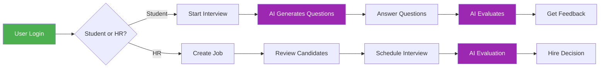

# How System Works

```mermaid
flowchart LR
    A[User Login] --> B{Student or HR?}
    
    B -->|Student| C[Start Interview]
    C --> D[AI Generates Questions]
    D --> E[Answer Questions]
    E --> F[AI Evaluates]
    F --> G[Get Feedback]
    
    B -->|HR| H[Create Job]
    H --> I[Review Candidates]
    I --> J[Schedule Interview]
    J --> K[AI Evaluation]
    K --> L[Hire Decision]
    
    style A fill:#4CAF50,color:#fff
    style D fill:#9C27B0,color:#fff
    style F fill:#9C27B0,color:#fff
    style K fill:#9C27B0,color:#fff
```
