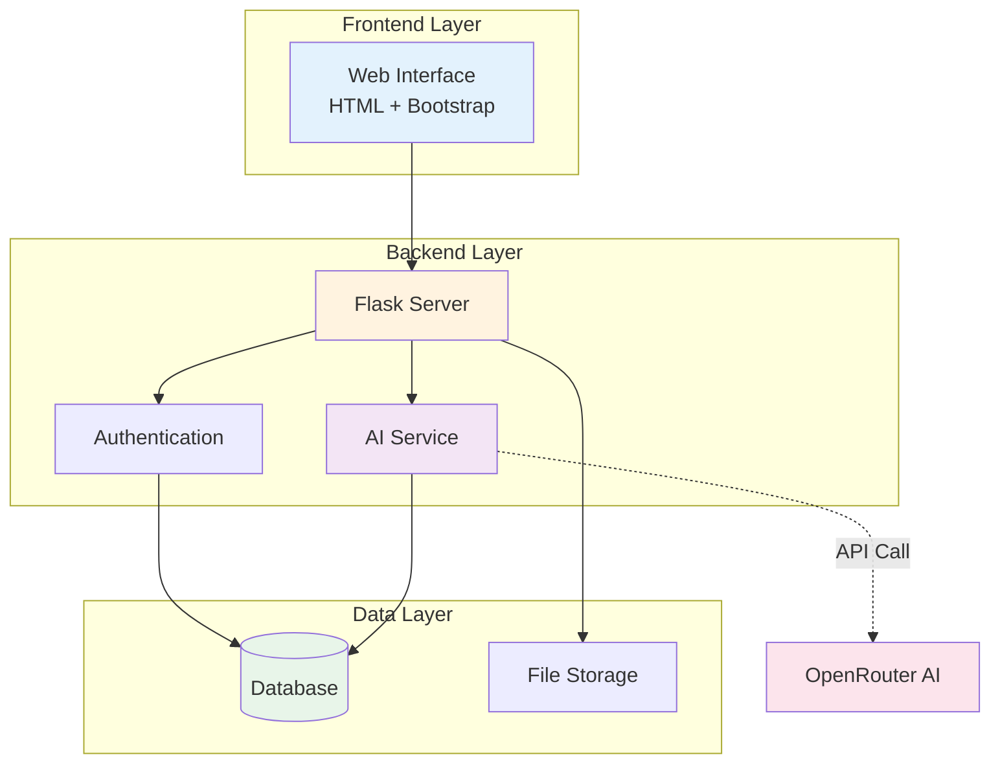

# Simple Architecture

```mermaid
graph TB
    subgraph Frontend["Frontend Layer"]
        UI[Web Interface<br/>HTML + Bootstrap]
    end
    
    subgraph Backend["Backend Layer"]
        Flask[Flask Server]
        Auth[Authentication]
        AI[AI Service]
    end
    
    subgraph Data["Data Layer"]
        DB[(Database)]
        Files[File Storage]
    end
    
    UI --> Flask
    Flask --> Auth
    Flask --> AI
    Auth --> DB
    AI --> DB
    Flask --> Files
    
    AI -.->|API Call| API[OpenRouter AI]
    
    style UI fill:#E3F2FD
    style Flask fill:#FFF3E0
    style AI fill:#F3E5F5
    style DB fill:#E8F5E9
    style API fill:#FCE4EC
```
