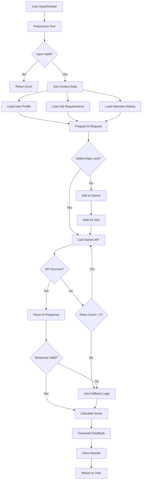

# Ai Processing Flow

```mermaid
flowchart TD
    Input[User Input/Answer] --> Preprocess[Preprocess Text]
    Preprocess --> Validate{Input Valid?}
    
    Validate -->|No| Error[Return Error]
    Validate -->|Yes| Context[Get Context Data]
    
    Context --> Profile[Load User Profile]
    Context --> JobReq[Load Job Requirements]
    Context --> History[Load Interview History]
    
    Profile --> AIRequest[Prepare AI Request]
    JobReq --> AIRequest
    History --> AIRequest
    
    AIRequest --> RateLimit{Within Rate Limit?}
    RateLimit -->|No| Queue[Add to Queue]
    RateLimit -->|Yes| GeminiAPI[Call Gemini API]
    
    Queue --> Wait[Wait for Slot]
    Wait --> GeminiAPI
    
    GeminiAPI --> APIResponse{API Success?}
    APIResponse -->|No| Retry{Retry Count < 3?}
    APIResponse -->|Yes| ParseResponse[Parse AI Response]
    
    Retry -->|Yes| GeminiAPI
    Retry -->|No| Fallback[Use Fallback Logic]
    
    ParseResponse --> Validate2{Response Valid?}
    Validate2 -->|No| Fallback
    Validate2 -->|Yes| Score[Calculate Score]
    
    Fallback --> Score
    Score --> Feedback[Generate Feedback]
    Feedback --> Store[Store Results]
    Store --> Return[Return to User]
```
