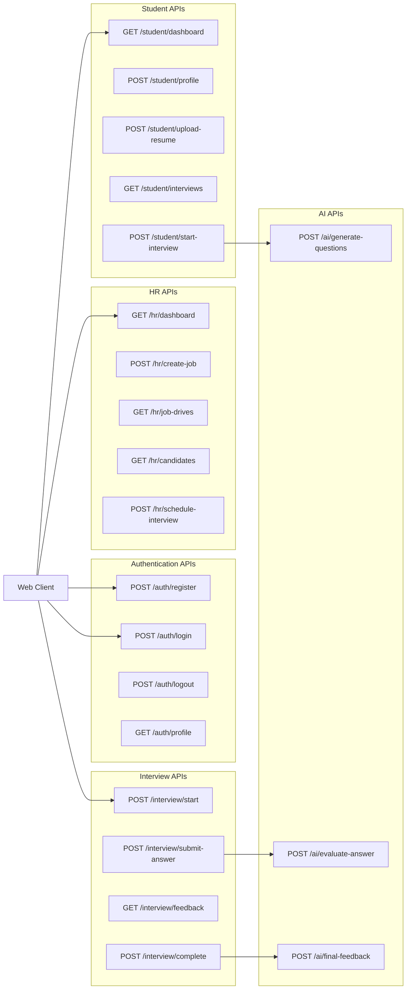

# Api Endpoints

```mermaid
graph LR
    subgraph "Authentication APIs"
        A1[POST /auth/register]
        A2[POST /auth/login]
        A3[POST /auth/logout]
        A4[GET /auth/profile]
    end
    
    subgraph "Student APIs"
        S1[GET /student/dashboard]
        S2[POST /student/profile]
        S3[POST /student/upload-resume]
        S4[GET /student/interviews]
        S5[POST /student/start-interview]
    end
    
    subgraph "HR APIs"
        H1[GET /hr/dashboard]
        H2[POST /hr/create-job]
        H3[GET /hr/job-drives]
        H4[GET /hr/candidates]
        H5[POST /hr/schedule-interview]
    end
    
    subgraph "Interview APIs"
        I1[POST /interview/start]
        I2[POST /interview/submit-answer]
        I3[GET /interview/feedback]
        I4[POST /interview/complete]
    end
    
    subgraph "AI APIs"
        AI1[POST /ai/generate-questions]
        AI2[POST /ai/evaluate-answer]
        AI3[POST /ai/final-feedback]
    end
    
    Client[Web Client] --> A1
    Client --> A2
    Client --> S1
    Client --> H1
    Client --> I1
    
    S5 --> AI1
    I2 --> AI2
    I4 --> AI3
```
