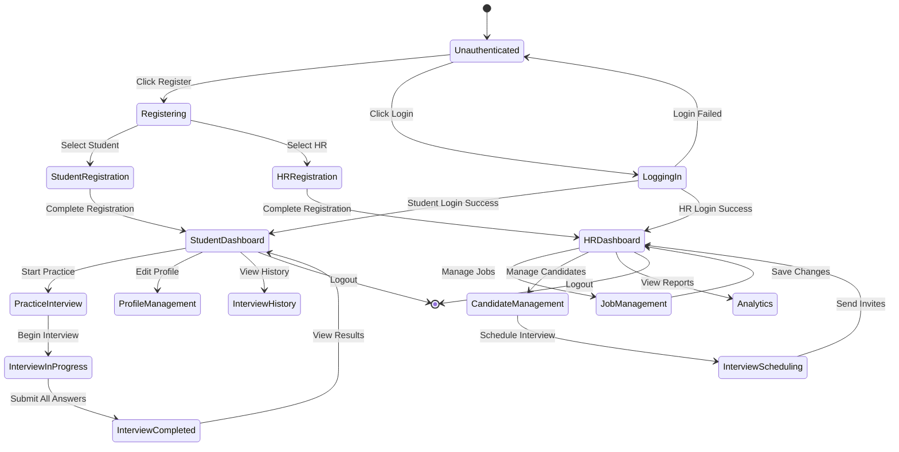

# Application States

```mermaid
stateDiagram-v2
    [*] --> Unauthenticated
    
    Unauthenticated --> Registering : Click Register
    Unauthenticated --> LoggingIn : Click Login
    
    Registering --> StudentRegistration : Select Student
    Registering --> HRRegistration : Select HR
    
    StudentRegistration --> StudentDashboard : Complete Registration
    HRRegistration --> HRDashboard : Complete Registration
    
    LoggingIn --> StudentDashboard : Student Login Success
    LoggingIn --> HRDashboard : HR Login Success
    LoggingIn --> Unauthenticated : Login Failed
    
    StudentDashboard --> PracticeInterview : Start Practice
    StudentDashboard --> ProfileManagement : Edit Profile
    StudentDashboard --> InterviewHistory : View History
    
    PracticeInterview --> InterviewInProgress : Begin Interview
    InterviewInProgress --> InterviewCompleted : Submit All Answers
    InterviewCompleted --> StudentDashboard : View Results
    
    HRDashboard --> JobManagement : Manage Jobs
    HRDashboard --> CandidateManagement : Manage Candidates
    HRDashboard --> Analytics : View Reports
    
    JobManagement --> HRDashboard : Save Changes
    CandidateManagement --> InterviewScheduling : Schedule Interview
    InterviewScheduling --> HRDashboard : Send Invites
    
    StudentDashboard --> [*] : Logout
    HRDashboard --> [*] : Logout
```
