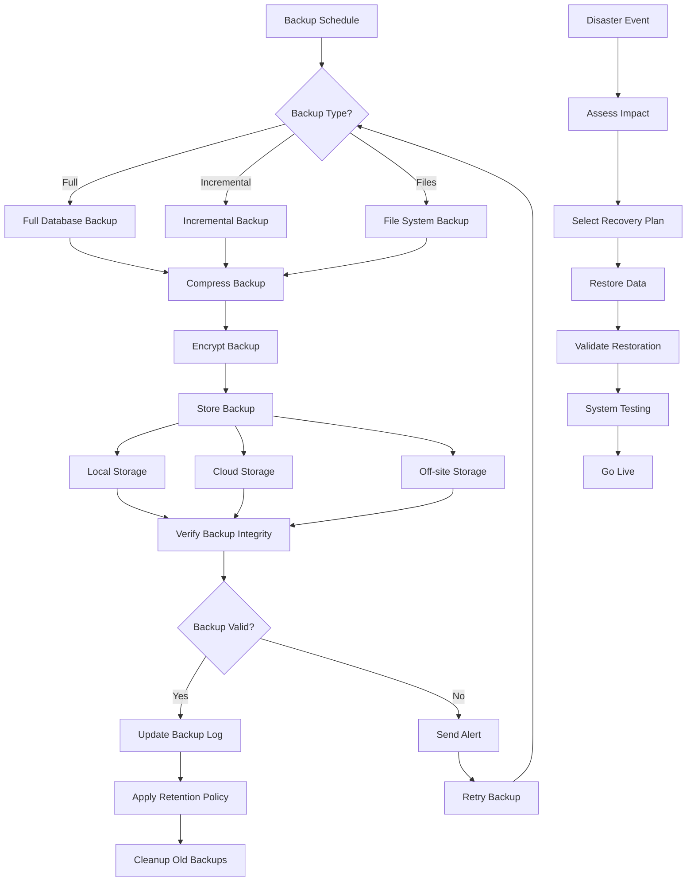

# Backup Recovery

```mermaid
flowchart TD
    Schedule[Backup Schedule] --> BackupType{Backup Type?}
    
    BackupType -->|Full| FullBackup[Full Database Backup]
    BackupType -->|Incremental| IncrementalBackup[Incremental Backup]
    BackupType -->|Files| FileBackup[File System Backup]
    
    FullBackup --> Compress[Compress Backup]
    IncrementalBackup --> Compress
    FileBackup --> Compress
    
    Compress --> Encrypt[Encrypt Backup]
    Encrypt --> Store[Store Backup]
    
    Store --> LocalStorage[Local Storage]
    Store --> CloudStorage[Cloud Storage]
    Store --> OffSite[Off-site Storage]
    
    LocalStorage --> Verify[Verify Backup Integrity]
    CloudStorage --> Verify
    OffSite --> Verify
    
    Verify --> Success{Backup Valid?}
    Success -->|Yes| UpdateLog[Update Backup Log]
    Success -->|No| Alert[Send Alert]
    
    Alert --> RetryBackup[Retry Backup]
    RetryBackup --> BackupType
    
    UpdateLog --> Retention[Apply Retention Policy]
    Retention --> Cleanup[Cleanup Old Backups]
    
    DisasterEvent[Disaster Event] --> AssessImpact[Assess Impact]
    AssessImpact --> RecoveryPlan[Select Recovery Plan]
    
    RecoveryPlan --> RestoreData[Restore Data]
    RestoreData --> ValidateRestore[Validate Restoration]
    ValidateRestore --> SystemTest[System Testing]
    SystemTest --> GoLive[Go Live]
```
