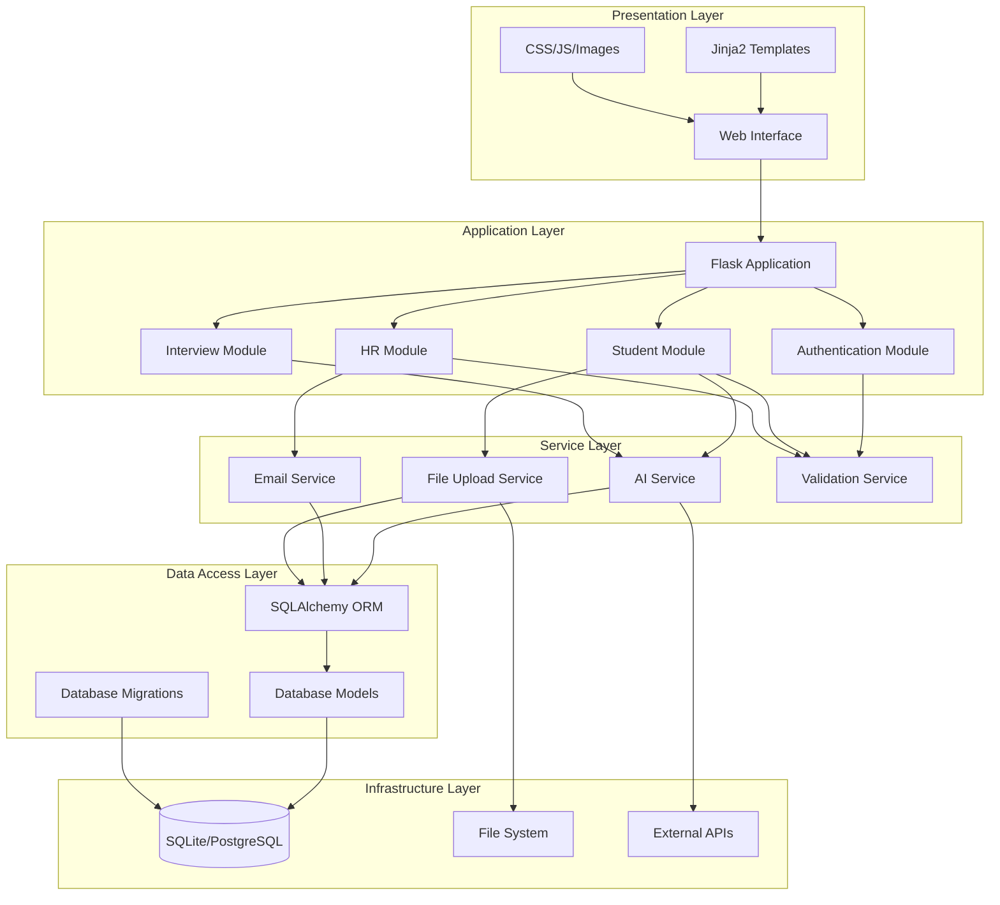

# Component Architecture

```mermaid
graph TB
    subgraph "Presentation Layer"
        WebUI[Web Interface]
        Templates[Jinja2 Templates]
        StaticFiles[CSS/JS/Images]
    end
    
    subgraph "Application Layer"
        FlaskApp[Flask Application]
        AuthModule[Authentication Module]
        StudentModule[Student Module]
        HRModule[HR Module]
        InterviewModule[Interview Module]
    end
    
    subgraph "Service Layer"
        AIService[AI Service]
        EmailService[Email Service]
        FileService[File Upload Service]
        ValidationService[Validation Service]
    end
    
    subgraph "Data Access Layer"
        SQLAlchemy[SQLAlchemy ORM]
        Models[Database Models]
        Migrations[Database Migrations]
    end
    
    subgraph "Infrastructure Layer"
        Database[(SQLite/PostgreSQL)]
        FileSystem[File System]
        ExternalAPIs[External APIs]
    end
    
    WebUI --> FlaskApp
    Templates --> WebUI
    StaticFiles --> WebUI
    
    FlaskApp --> AuthModule
    FlaskApp --> StudentModule
    FlaskApp --> HRModule
    FlaskApp --> InterviewModule
    
    StudentModule --> AIService
    InterviewModule --> AIService
    HRModule --> EmailService
    StudentModule --> FileService
    
    AuthModule --> ValidationService
    StudentModule --> ValidationService
    HRModule --> ValidationService
    
    AIService --> SQLAlchemy
    EmailService --> SQLAlchemy
    FileService --> SQLAlchemy
    
    SQLAlchemy --> Models
    Models --> Database
    Migrations --> Database
    
    FileService --> FileSystem
    AIService --> ExternalAPIs
```
