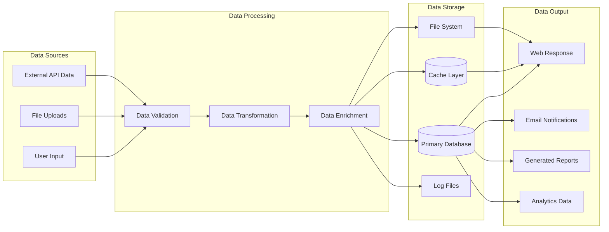

# Data Flow

```mermaid
flowchart LR
    subgraph "Data Sources"
        UserInput[User Input]
        FileUpload[File Uploads]
        APIData[External API Data]
    end
    
    subgraph "Data Processing"
        Validation[Data Validation]
        Transformation[Data Transformation]
        Enrichment[Data Enrichment]
    end
    
    subgraph "Data Storage"
        Database[(Primary Database)]
        FileSystem[File System]
        Cache[(Cache Layer)]
        Logs[Log Files]
    end
    
    subgraph "Data Output"
        WebResponse[Web Response]
        EmailNotif[Email Notifications]
        Reports[Generated Reports]
        Analytics[Analytics Data]
    end
    
    UserInput --> Validation
    FileUpload --> Validation
    APIData --> Validation
    
    Validation --> Transformation
    Transformation --> Enrichment
    
    Enrichment --> Database
    Enrichment --> FileSystem
    Enrichment --> Cache
    Enrichment --> Logs
    
    Database --> WebResponse
    Database --> EmailNotif
    Database --> Reports
    Database --> Analytics
    
    Cache --> WebResponse
    FileSystem --> WebResponse
```
