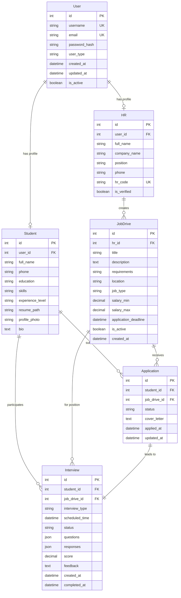

# Database Schema

```mermaid
erDiagram
    User {
        int id PK
        string username UK
        string email UK
        string password_hash
        string user_type
        datetime created_at
        datetime updated_at
        boolean is_active
    }
    
    Student {
        int id PK
        int user_id FK
        string full_name
        string phone
        string education
        string skills
        string experience_level
        string resume_path
        string profile_photo
        text bio
    }
    
    HR {
        int id PK
        int user_id FK
        string full_name
        string company_name
        string position
        string phone
        string hr_code UK
        boolean is_verified
    }
    
    JobDrive {
        int id PK
        int hr_id FK
        string title
        text description
        string requirements
        string location
        string job_type
        decimal salary_min
        decimal salary_max
        datetime application_deadline
        boolean is_active
        datetime created_at
    }
    
    Interview {
        int id PK
        int student_id FK
        int job_drive_id FK
        string interview_type
        datetime scheduled_time
        string status
        json questions
        json responses
        decimal score
        text feedback
        datetime created_at
        datetime completed_at
    }
    
    Application {
        int id PK
        int student_id FK
        int job_drive_id FK
        string status
        text cover_letter
        datetime applied_at
        datetime updated_at
    }
    
    User ||--o| Student : "has profile"
    User ||--o| HR : "has profile"
    HR ||--o{ JobDrive : "creates"
    Student ||--o{ Application : "submits"
    JobDrive ||--o{ Application : "receives"
    Student ||--o{ Interview : "participates"
    JobDrive ||--o{ Interview : "for position"
    Application ||--|| Interview : "leads to"

```
