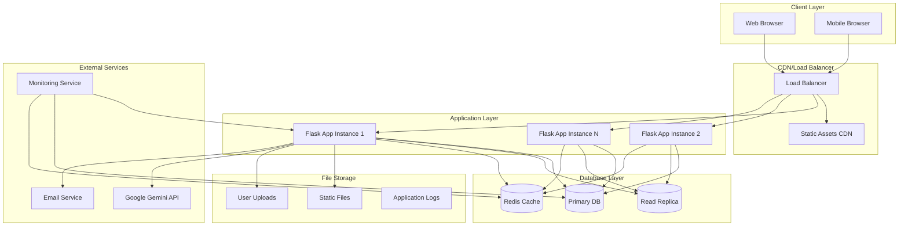

# Deployment Architecture

```mermaid
graph TB
    subgraph "Client Layer"
        Browser[Web Browser]
        Mobile[Mobile Browser]
    end
    
    subgraph "CDN/Load Balancer"
        LB[Load Balancer]
        CDN[Static Assets CDN]
    end
    
    subgraph "Application Layer"
        App1[Flask App Instance 1]
        App2[Flask App Instance 2]
        App3[Flask App Instance N]
    end
    
    subgraph "Database Layer"
        Primary[(Primary DB)]
        Replica[(Read Replica)]
        Cache[(Redis Cache)]
    end
    
    subgraph "File Storage"
        Static[Static Files]
        Uploads[User Uploads]
        Logs[Application Logs]
    end
    
    subgraph "External Services"
        Gemini[Google Gemini API]
        SMTP[Email Service]
        Monitor[Monitoring Service]
    end
    
    Browser --> LB
    Mobile --> LB
    LB --> CDN
    LB --> App1
    LB --> App2
    LB --> App3
    
    App1 --> Primary
    App2 --> Primary
    App3 --> Primary
    App1 --> Replica
    App2 --> Replica
    App3 --> Replica
    
    App1 --> Cache
    App2 --> Cache
    App3 --> Cache
    
    App1 --> Static
    App1 --> Uploads
    App1 --> Gemini
    App1 --> SMTP
    
    Monitor --> App1
    Monitor --> Primary
    Monitor --> Cache
```
