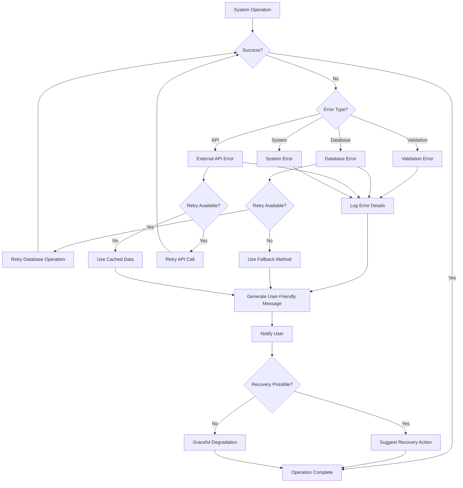

# Error Handling

```mermaid
flowchart TD
    Operation[System Operation] --> Success{Success?}
    
    Success -->|Yes| Complete[Operation Complete]
    Success -->|No| ErrorType{Error Type?}
    
    ErrorType -->|Validation| ValidationError[Validation Error]
    ErrorType -->|Database| DatabaseError[Database Error]
    ErrorType -->|API| APIError[External API Error]
    ErrorType -->|System| SystemError[System Error]
    
    ValidationError --> LogError[Log Error Details]
    DatabaseError --> LogError
    APIError --> LogError
    SystemError --> LogError
    
    LogError --> UserFriendly[Generate User-Friendly Message]
    
    DatabaseError --> DBRetry{Retry Available?}
    DBRetry -->|Yes| RetryDB[Retry Database Operation]
    DBRetry -->|No| Fallback[Use Fallback Method]
    
    APIError --> APIRetry{Retry Available?}
    APIRetry -->|Yes| RetryAPI[Retry API Call]
    APIRetry -->|No| CachedData[Use Cached Data]
    
    RetryDB --> Success
    RetryAPI --> Success
    Fallback --> UserFriendly
    CachedData --> UserFriendly
    
    UserFriendly --> NotifyUser[Notify User]
    NotifyUser --> RecoveryAction{Recovery Possible?}
    
    RecoveryAction -->|Yes| SuggestAction[Suggest Recovery Action]
    RecoveryAction -->|No| GracefulDegradation[Graceful Degradation]
    
    SuggestAction --> Complete
    GracefulDegradation --> Complete
```
