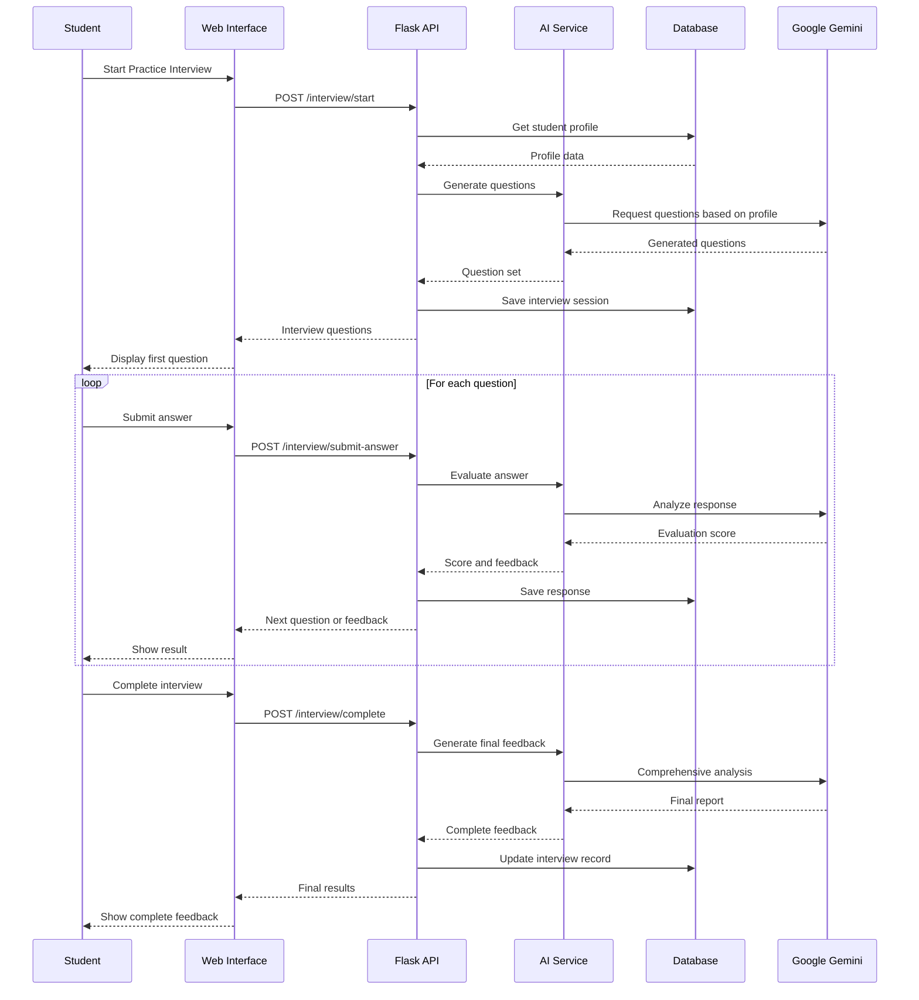

# Interview Process

```mermaid
sequenceDiagram
    participant S as Student
    participant UI as Web Interface
    participant API as Flask API
    participant AI as AI Service
    participant DB as Database
    participant Gemini as Google Gemini
    
    S->>UI: Start Practice Interview
    UI->>API: POST /interview/start
    API->>DB: Get student profile
    DB-->>API: Profile data
    API->>AI: Generate questions
    AI->>Gemini: Request questions based on profile
    Gemini-->>AI: Generated questions
    AI-->>API: Question set
    API->>DB: Save interview session
    API-->>UI: Interview questions
    UI-->>S: Display first question
    
    loop For each question
        S->>UI: Submit answer
        UI->>API: POST /interview/submit-answer
        API->>AI: Evaluate answer
        AI->>Gemini: Analyze response
        Gemini-->>AI: Evaluation score
        AI-->>API: Score and feedback
        API->>DB: Save response
        API-->>UI: Next question or feedback
        UI-->>S: Show result
    end
    
    S->>UI: Complete interview
    UI->>API: POST /interview/complete
    API->>AI: Generate final feedback
    AI->>Gemini: Comprehensive analysis
    Gemini-->>AI: Final report
    AI-->>API: Complete feedback
    API->>DB: Update interview record
    API-->>UI: Final results
    UI-->>S: Show complete feedback
```
