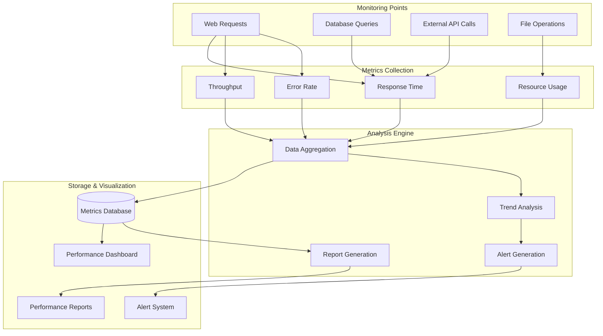

# Performance Monitoring

```mermaid
graph TB
    subgraph "Monitoring Points"
        WebReq[Web Requests]
        DBQuery[Database Queries]
        APICall[External API Calls]
        FileOp[File Operations]
    end
    
    subgraph "Metrics Collection"
        ResponseTime[Response Time]
        Throughput[Throughput]
        ErrorRate[Error Rate]
        ResourceUsage[Resource Usage]
    end
    
    subgraph "Analysis Engine"
        Aggregation[Data Aggregation]
        Trending[Trend Analysis]
        Alerting[Alert Generation]
        Reporting[Report Generation]
    end
    
    subgraph "Storage & Visualization"
        MetricsDB[(Metrics Database)]
        Dashboard[Performance Dashboard]
        Alerts[Alert System]
        Reports[Performance Reports]
    end
    
    WebReq --> ResponseTime
    WebReq --> Throughput
    WebReq --> ErrorRate
    
    DBQuery --> ResponseTime
    APICall --> ResponseTime
    FileOp --> ResourceUsage
    
    ResponseTime --> Aggregation
    Throughput --> Aggregation
    ErrorRate --> Aggregation
    ResourceUsage --> Aggregation
    
    Aggregation --> MetricsDB
    Aggregation --> Trending
    Trending --> Alerting
    Alerting --> Alerts
    
    MetricsDB --> Dashboard
    MetricsDB --> Reporting
    Reporting --> Reports
```
