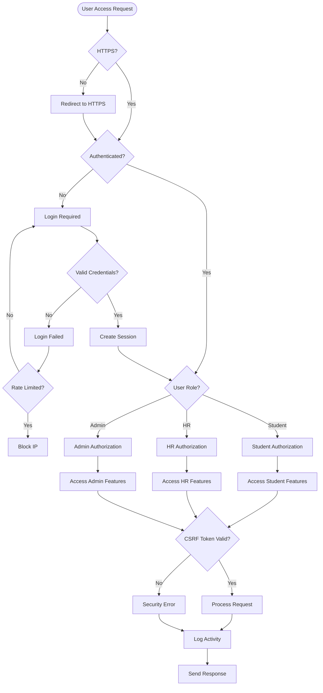

# Security Flow

```mermaid
flowchart TD
    Start([User Access Request]) --> HTTPS{HTTPS?}
    HTTPS -->|No| Redirect[Redirect to HTTPS]
    HTTPS -->|Yes| Auth{Authenticated?}
    
    Redirect --> Auth
    Auth -->|No| Login[Login Required]
    Auth -->|Yes| Role{User Role?}
    
    Login --> Validate{Valid Credentials?}
    Validate -->|No| LoginFail[Login Failed]
    Validate -->|Yes| Session[Create Session]
    
    LoginFail --> RateLimit{Rate Limited?}
    RateLimit -->|Yes| Block[Block IP]
    RateLimit -->|No| Login
    
    Session --> Role
    Role -->|Student| StudentAuth[Student Authorization]
    Role -->|HR| HRAuth[HR Authorization]
    Role -->|Admin| AdminAuth[Admin Authorization]
    
    StudentAuth --> StudentAccess[Access Student Features]
    HRAuth --> HRAccess[Access HR Features]
    AdminAuth --> AdminAccess[Access Admin Features]
    
    StudentAccess --> CSRF{CSRF Token Valid?}
    HRAccess --> CSRF
    AdminAccess --> CSRF
    
    CSRF -->|No| SecurityError[Security Error]
    CSRF -->|Yes| ProcessRequest[Process Request]
    
    ProcessRequest --> Audit[Log Activity]
    SecurityError --> Audit
    
    Audit --> Response[Send Response]
```
