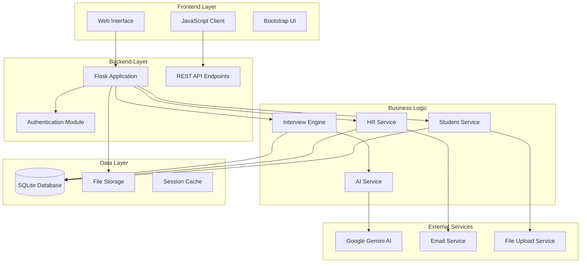

# System Architecture

```mermaid
graph TB
    subgraph "Frontend Layer"
        UI[Web Interface]
        JS[JavaScript Client]
        CSS[Bootstrap UI]
    end
    
    subgraph "Backend Layer"
        Flask[Flask Application]
        Auth[Authentication Module]
        API[REST API Endpoints]
    end
    
    subgraph "Business Logic"
        Student[Student Service]
        HR[HR Service]
        Interview[Interview Engine]
        AI[AI Service]
    end
    
    subgraph "Data Layer"
        DB[(SQLite Database)]
        Files[File Storage]
        Cache[Session Cache]
    end
    
    subgraph "External Services"
        Gemini[Google Gemini AI]
        Email[Email Service]
        Upload[File Upload Service]
    end
    
    UI --> Flask
    JS --> API
    Flask --> Auth
    Flask --> Student
    Flask --> HR
    Flask --> Interview
    Interview --> AI
    AI --> Gemini
    Student --> DB
    HR --> DB
    Interview --> DB
    Flask --> Files
    HR --> Email
    Student --> Upload
```
