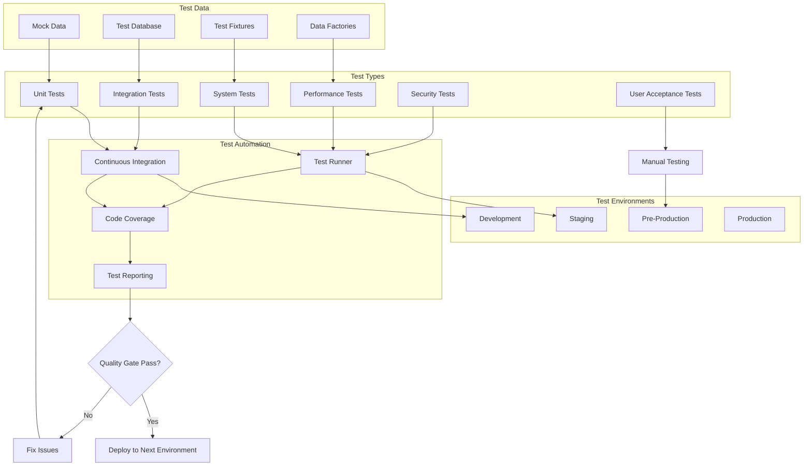

# Testing Strategy

```mermaid
graph TB
    subgraph "Test Types"
        Unit[Unit Tests]
        Integration[Integration Tests]
        System[System Tests]
        Performance[Performance Tests]
        Security[Security Tests]
        UAT[User Acceptance Tests]
    end
    
    subgraph "Test Automation"
        CI[Continuous Integration]
        TestRunner[Test Runner]
        Coverage[Code Coverage]
        Reporting[Test Reporting]
    end
    
    subgraph "Test Environments"
        Dev[Development]
        Staging[Staging]
        PreProd[Pre-Production]
        Prod[Production]
    end
    
    subgraph "Test Data"
        MockData[Mock Data]
        TestDB[Test Database]
        Fixtures[Test Fixtures]
        Factories[Data Factories]
    end
    
    Unit --> CI
    Integration --> CI
    System --> TestRunner
    Performance --> TestRunner
    Security --> TestRunner
    UAT --> Manual[Manual Testing]
    
    CI --> Dev
    TestRunner --> Staging
    Manual --> PreProd
    
    MockData --> Unit
    TestDB --> Integration
    Fixtures --> System
    Factories --> Performance
    
    CI --> Coverage
    TestRunner --> Coverage
    Coverage --> Reporting
    
    Reporting --> QualityGate{Quality Gate Pass?}
    QualityGate -->|Yes| Deploy[Deploy to Next Environment]
    QualityGate -->|No| FixIssues[Fix Issues]
    
    FixIssues --> Unit
```
