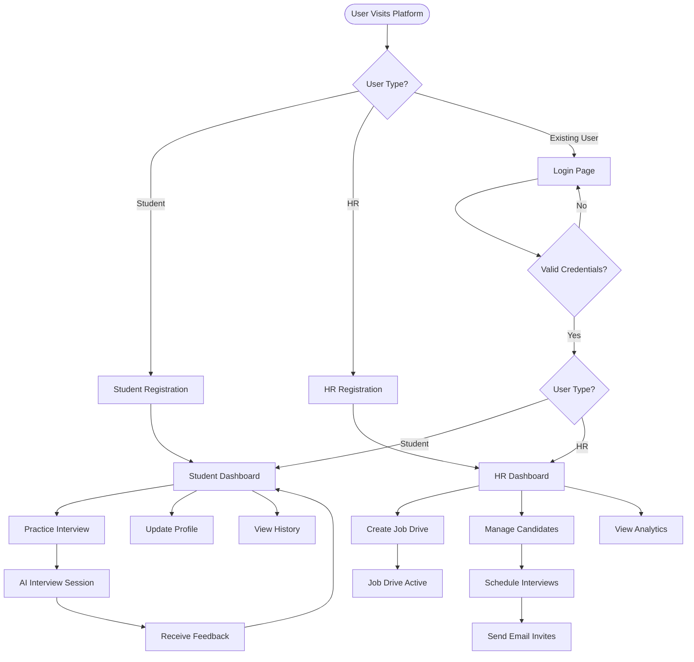

# User Flow

```mermaid
flowchart TD
    Start([User Visits Platform]) --> Choice{User Type?}
    
    Choice -->|Student| StudentReg[Student Registration]
    Choice -->|HR| HRReg[HR Registration]
    Choice -->|Existing User| Login[Login Page]
    
    StudentReg --> StudentDash[Student Dashboard]
    HRReg --> HRDash[HR Dashboard]
    Login --> AuthCheck{Valid Credentials?}
    
    AuthCheck -->|Yes| UserType{User Type?}
    AuthCheck -->|No| Login
    
    UserType -->|Student| StudentDash
    UserType -->|HR| HRDash
    
    StudentDash --> Practice[Practice Interview]
    StudentDash --> Profile[Update Profile]
    StudentDash --> History[View History]
    
    Practice --> AIInterview[AI Interview Session]
    AIInterview --> Feedback[Receive Feedback]
    Feedback --> StudentDash
    
    HRDash --> CreateJob[Create Job Drive]
    HRDash --> ManageCand[Manage Candidates]
    HRDash --> Analytics[View Analytics]
    
    CreateJob --> JobPosted[Job Drive Active]
    ManageCand --> Schedule[Schedule Interviews]
    Schedule --> SendInvite[Send Email Invites]
```
