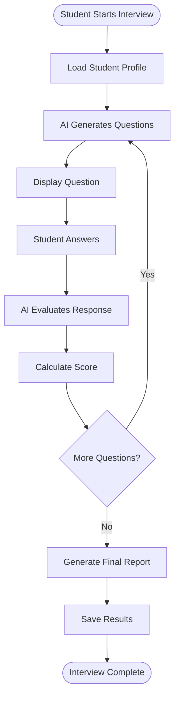

# Ai Interview Flowchart

```mermaid
flowchart TD
    Start([Student Starts Interview]) --> Profile[Load Student Profile]
    Profile --> Generate[AI Generates Questions]
    Generate --> Display[Display Question]
    Display --> Answer[Student Answers]
    Answer --> Evaluate[AI Evaluates Response]
    Evaluate --> Score[Calculate Score]
    Score --> More{More Questions?}
    More -->|Yes| Generate
    More -->|No| Final[Generate Final Report]
    Final --> Save[Save Results]
    Save --> End([Interview Complete])
```
