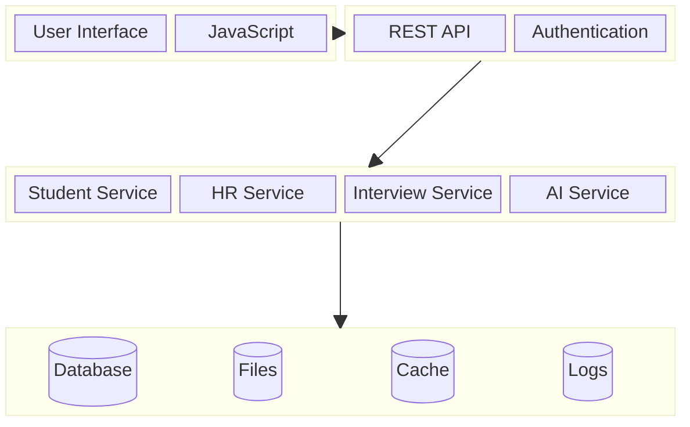

# Architecture Blocks

```mermaid
block-beta
    columns 4
    
    block:Frontend:2
        UI["User Interface"]
        JS["JavaScript"]
    end
    
    block:Backend:2
        API["REST API"]
        Auth["Authentication"]
    end
    
    space:4
    
    block:Services:4
        Student["Student Service"] HR["HR Service"] Interview["Interview Service"] AI["AI Service"]
    end
    
    space:4
    
    block:Data:4
        DB[("Database")] Files[("Files")] Cache[("Cache")] Logs[("Logs")]
    end
    
    Frontend --> Backend
    Backend --> Services
    Services --> Data
```
