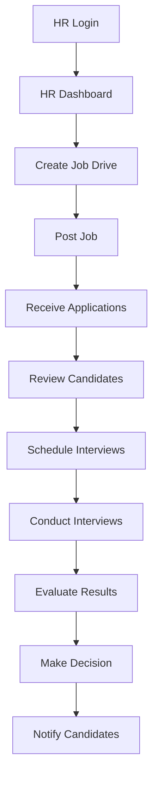

# Hr Workflow

```mermaid
flowchart TD
    Login[HR Login] --> Dashboard[HR Dashboard]
    Dashboard --> Create[Create Job Drive]
    Create --> Post[Post Job]
    Post --> Applications[Receive Applications]
    Applications --> Review[Review Candidates]
    Review --> Schedule[Schedule Interviews]
    Schedule --> Conduct[Conduct Interviews]
    Conduct --> Evaluate[Evaluate Results]
    Evaluate --> Decision[Make Decision]
    Decision --> Notify[Notify Candidates]
```
