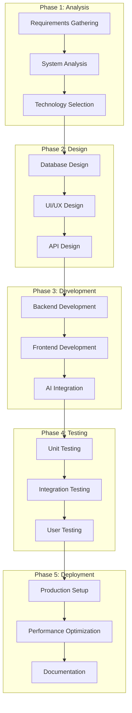

# Project Methodology

```mermaid
flowchart TB
    subgraph "Phase 1: Analysis"
        A1[Requirements Gathering]
        A2[System Analysis]
        A3[Technology Selection]
    end
    
    subgraph "Phase 2: Design"
        D1[Database Design]
        D2[UI/UX Design]
        D3[API Design]
    end
    
    subgraph "Phase 3: Development"
        Dev1[Backend Development]
        Dev2[Frontend Development]
        Dev3[AI Integration]
    end
    
    subgraph "Phase 4: Testing"
        T1[Unit Testing]
        T2[Integration Testing]
        T3[User Testing]
    end
    
    subgraph "Phase 5: Deployment"
        Dep1[Production Setup]
        Dep2[Performance Optimization]
        Dep3[Documentation]
    end
    
    A1 --> A2 --> A3
    A3 --> D1 --> D2 --> D3
    D3 --> Dev1 --> Dev2 --> Dev3
    Dev3 --> T1 --> T2 --> T3
    T3 --> Dep1 --> Dep2 --> Dep3
```
