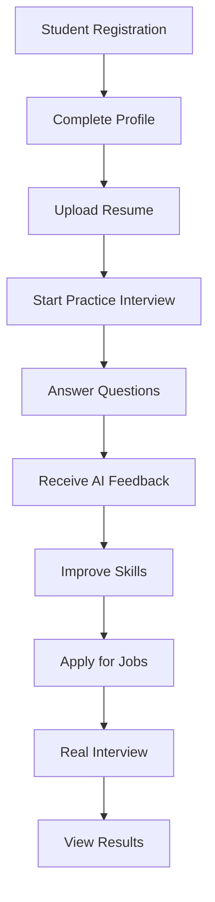

# Student Workflow

```mermaid
flowchart TD
    Register[Student Registration] --> Profile[Complete Profile]
    Profile --> Upload[Upload Resume]
    Upload --> Practice[Start Practice Interview]
    Practice --> Questions[Answer Questions]
    Questions --> Feedback[Receive AI Feedback]
    Feedback --> Improve[Improve Skills]
    Improve --> Apply[Apply for Jobs]
    Apply --> Interview[Real Interview]
    Interview --> Results[View Results]
```
