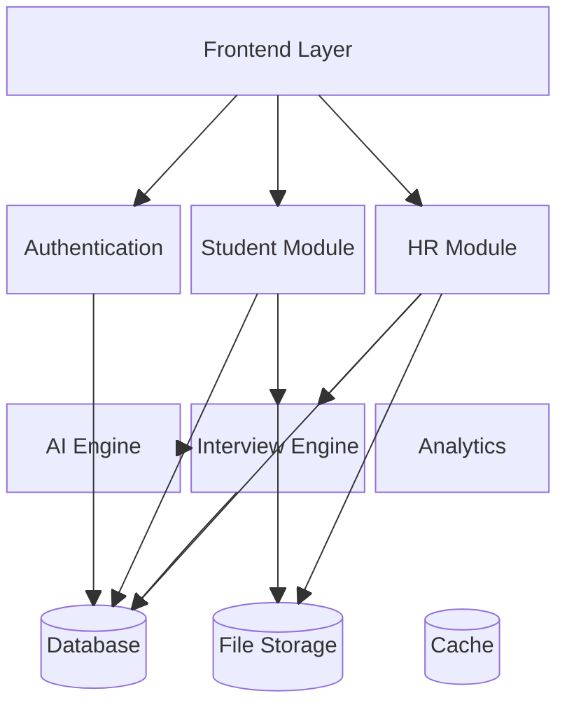

# System Block Diagram

```mermaid
block-beta
    columns 3
    
    Frontend["Frontend Layer"]:3
    space:3
    
    Auth["Authentication"] Student["Student Module"] HR["HR Module"]
    space:3
    
    AI["AI Engine"] Interview["Interview Engine"] Analytics["Analytics"]
    space:3
    
    Database[("Database")] Files[("File Storage")] Cache[("Cache")]
    
    Frontend --> Auth
    Frontend --> Student  
    Frontend --> HR
    
    Student --> Interview
    HR --> Interview
    Interview --> AI
    
    Auth --> Database
    Student --> Database
    HR --> Database
    Interview --> Database
    
    Student --> Files
    HR --> Files
```
