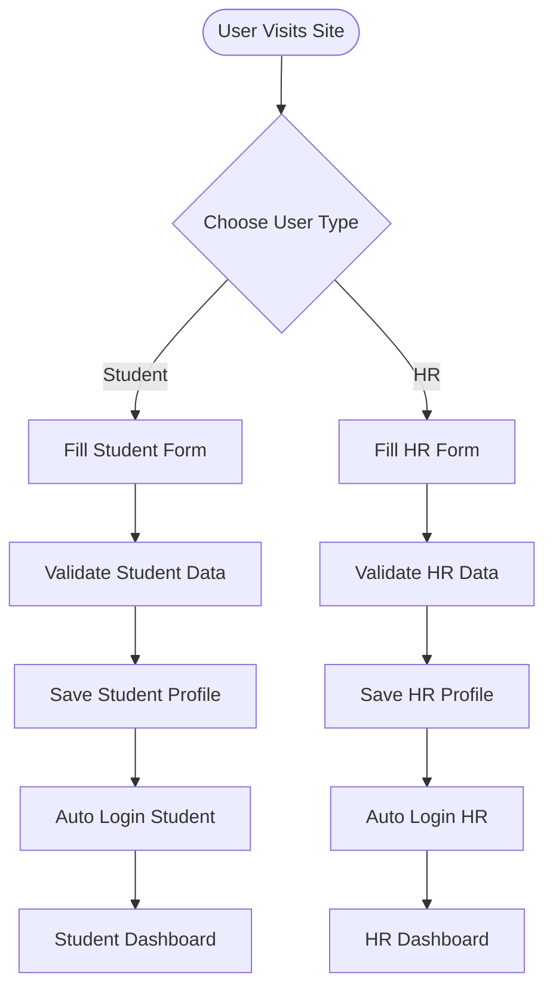

# User Registration Flowchart

```mermaid
flowchart TD
    Start([User Visits Site]) --> Choose{Choose User Type}
    Choose -->|Student| StudentForm[Fill Student Form]
    Choose -->|HR| HRForm[Fill HR Form]
    
    StudentForm --> ValidateS[Validate Student Data]
    HRForm --> ValidateH[Validate HR Data]
    
    ValidateS --> SaveS[Save Student Profile]
    ValidateH --> SaveH[Save HR Profile]
    
    SaveS --> LoginS[Auto Login Student]
    SaveH --> LoginH[Auto Login HR]
    
    LoginS --> DashS[Student Dashboard]
    LoginH --> DashH[HR Dashboard]
```
