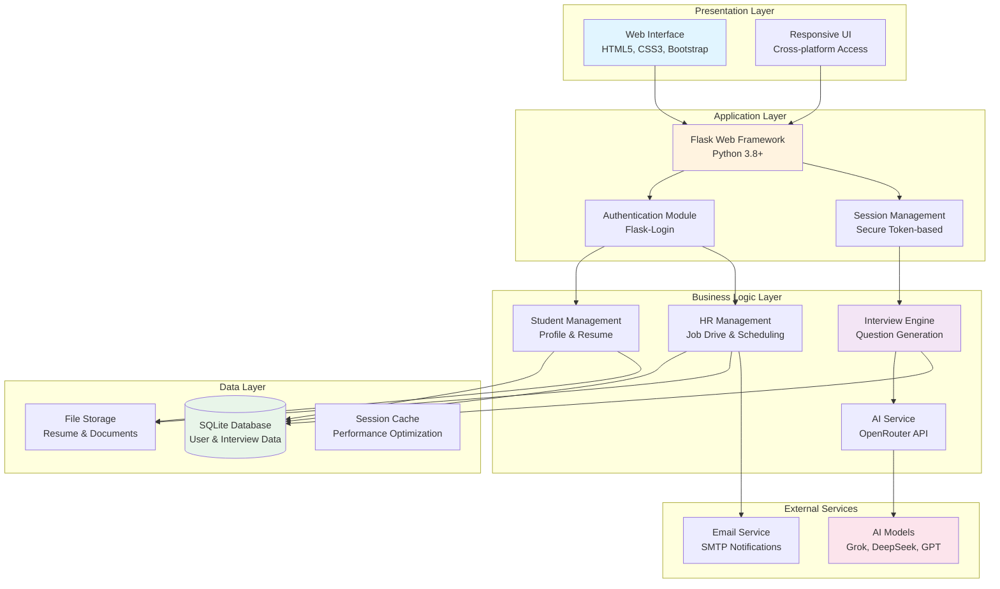

# 01 Proposed System Architecture

```mermaid
graph TB
    subgraph "Presentation Layer"
        A[Web Interface<br/>HTML5, CSS3, Bootstrap]
        B[Responsive UI<br/>Cross-platform Access]
    end
    
    subgraph "Application Layer"
        C[Flask Web Framework<br/>Python 3.8+]
        D[Authentication Module<br/>Flask-Login]
        E[Session Management<br/>Secure Token-based]
    end
    
    subgraph "Business Logic Layer"
        F[Student Management<br/>Profile & Resume]
        G[HR Management<br/>Job Drive & Scheduling]
        H[Interview Engine<br/>Question Generation]
        I[AI Service<br/>OpenRouter API]
    end
    
    subgraph "Data Layer"
        J[(SQLite Database<br/>User & Interview Data)]
        K[File Storage<br/>Resume & Documents]
        L[Session Cache<br/>Performance Optimization]
    end
    
    subgraph "External Services"
        M[AI Models<br/>Grok, DeepSeek, GPT]
        N[Email Service<br/>SMTP Notifications]
    end
    
    A --> C
    B --> C
    C --> D
    C --> E
    D --> F
    D --> G
    E --> H
    H --> I
    F --> J
    G --> J
    H --> J
    F --> K
    G --> K
    I --> M
    G --> N
    
    style A fill:#e1f5ff
    style C fill:#fff3e0
    style H fill:#f3e5f5
    style J fill:#e8f5e9
    style M fill:#fce4ec
```
