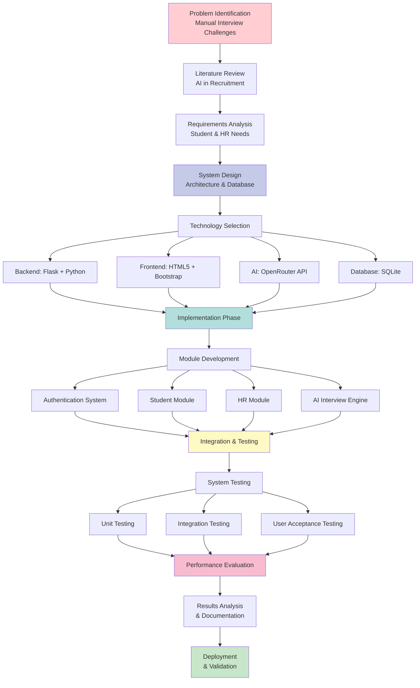

# 02 Research Methodology

```mermaid
flowchart TD
    A[Problem Identification<br/>Manual Interview Challenges] --> B[Literature Review<br/>AI in Recruitment]
    B --> C[Requirements Analysis<br/>Student & HR Needs]
    C --> D[System Design<br/>Architecture & Database]
    
    D --> E[Technology Selection]
    E --> E1[Backend: Flask + Python]
    E --> E2[Frontend: HTML5 + Bootstrap]
    E --> E3[AI: OpenRouter API]
    E --> E4[Database: SQLite]
    
    E1 --> F[Implementation Phase]
    E2 --> F
    E3 --> F
    E4 --> F
    
    F --> G[Module Development]
    G --> G1[Authentication System]
    G --> G2[Student Module]
    G --> G3[HR Module]
    G --> G4[AI Interview Engine]
    
    G1 --> H[Integration & Testing]
    G2 --> H
    G3 --> H
    G4 --> H
    
    H --> I[System Testing]
    I --> I1[Unit Testing]
    I --> I2[Integration Testing]
    I --> I3[User Acceptance Testing]
    
    I1 --> J[Performance Evaluation]
    I2 --> J
    I3 --> J
    
    J --> K[Results Analysis<br/>& Documentation]
    K --> L[Deployment<br/>& Validation]
    
    style A fill:#ffcdd2
    style D fill:#c5cae9
    style F fill:#b2dfdb
    style H fill:#fff9c4
    style J fill:#f8bbd0
    style L fill:#c8e6c9
```
