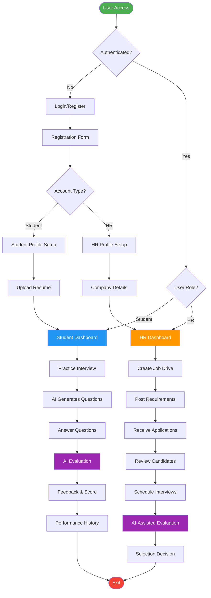

# 03 System Workflow

```mermaid
flowchart TD
    Start([User Access]) --> Auth{Authenticated?}
    Auth -->|No| Login[Login/Register]
    Auth -->|Yes| Role{User Role?}
    
    Login --> Register[Registration Form]
    Register --> Type{Account Type?}
    Type -->|Student| S1[Student Profile Setup]
    Type -->|HR| H1[HR Profile Setup]
    
    S1 --> S2[Upload Resume]
    S2 --> SDash[Student Dashboard]
    
    H1 --> H2[Company Details]
    H2 --> HDash[HR Dashboard]
    
    Role -->|Student| SDash
    Role -->|HR| HDash
    
    SDash --> S3[Practice Interview]
    S3 --> S4[AI Generates Questions]
    S4 --> S5[Answer Questions]
    S5 --> S6[AI Evaluation]
    S6 --> S7[Feedback & Score]
    S7 --> S8[Performance History]
    
    HDash --> H3[Create Job Drive]
    H3 --> H4[Post Requirements]
    H4 --> H5[Receive Applications]
    H5 --> H6[Review Candidates]
    H6 --> H7[Schedule Interviews]
    H7 --> H8[AI-Assisted Evaluation]
    H8 --> H9[Selection Decision]
    
    S8 --> End([Exit])
    H9 --> End
    
    style Start fill:#4caf50,color:#fff
    style SDash fill:#2196f3,color:#fff
    style HDash fill:#ff9800,color:#fff
    style S6 fill:#9c27b0,color:#fff
    style H8 fill:#9c27b0,color:#fff
    style End fill:#f44336,color:#fff
```
