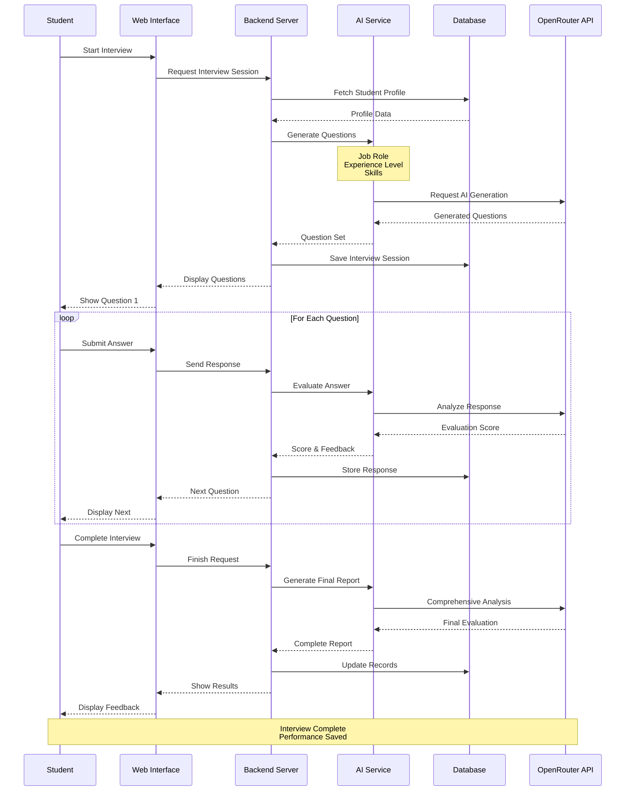

# 04 Ai Interview Process

```mermaid
sequenceDiagram
    participant S as Student
    participant UI as Web Interface
    participant BE as Backend Server
    participant AI as AI Service
    participant DB as Database
    participant API as OpenRouter API
    
    S->>UI: Start Interview
    UI->>BE: Request Interview Session
    BE->>DB: Fetch Student Profile
    DB-->>BE: Profile Data
    
    BE->>AI: Generate Questions
    Note over AI: Job Role<br/>Experience Level<br/>Skills
    AI->>API: Request AI Generation
    API-->>AI: Generated Questions
    AI-->>BE: Question Set
    
    BE->>DB: Save Interview Session
    BE-->>UI: Display Questions
    UI-->>S: Show Question 1
    
    loop For Each Question
        S->>UI: Submit Answer
        UI->>BE: Send Response
        BE->>AI: Evaluate Answer
        AI->>API: Analyze Response
        API-->>AI: Evaluation Score
        AI-->>BE: Score & Feedback
        BE->>DB: Store Response
        BE-->>UI: Next Question
        UI-->>S: Display Next
    end
    
    S->>UI: Complete Interview
    UI->>BE: Finish Request
    BE->>AI: Generate Final Report
    AI->>API: Comprehensive Analysis
    API-->>AI: Final Evaluation
    AI-->>BE: Complete Report
    BE->>DB: Update Records
    BE-->>UI: Show Results
    UI-->>S: Display Feedback
    
    Note over S,API: Interview Complete<br/>Performance Saved
```
