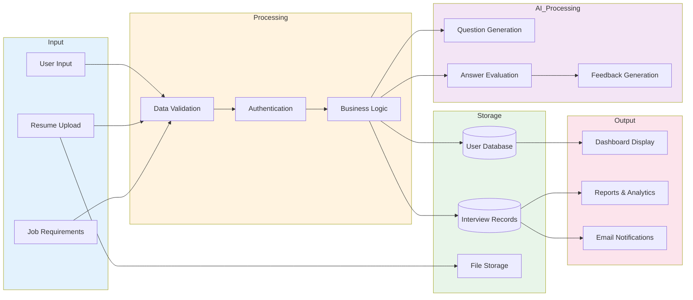

# 05 Data Flow Architecture

```mermaid
flowchart LR
    subgraph Input
        A[User Input]
        B[Resume Upload]
        C[Job Requirements]
    end
    
    subgraph Processing
        D[Data Validation]
        E[Authentication]
        F[Business Logic]
    end
    
    subgraph AI_Processing
        G[Question Generation]
        H[Answer Evaluation]
        I[Feedback Generation]
    end
    
    subgraph Storage
        J[(User Database)]
        K[(Interview Records)]
        L[File Storage]
    end
    
    subgraph Output
        M[Dashboard Display]
        N[Reports & Analytics]
        O[Email Notifications]
    end
    
    A --> D
    B --> D
    C --> D
    
    D --> E
    E --> F
    
    F --> G
    F --> H
    H --> I
    
    F --> J
    F --> K
    B --> L
    
    J --> M
    K --> N
    K --> O
    
    style Input fill:#e3f2fd
    style Processing fill:#fff3e0
    style AI_Processing fill:#f3e5f5
    style Storage fill:#e8f5e9
    style Output fill:#fce4ec
```
