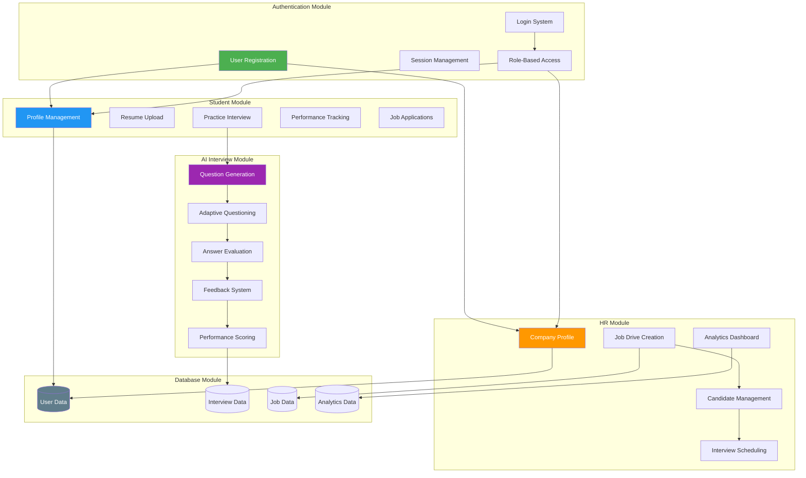

# 06 Module Architecture

```mermaid
graph TB
    subgraph "Authentication Module"
        A1[User Registration]
        A2[Login System]
        A3[Session Management]
        A4[Role-Based Access]
    end
    
    subgraph "Student Module"
        S1[Profile Management]
        S2[Resume Upload]
        S3[Practice Interview]
        S4[Performance Tracking]
        S5[Job Applications]
    end
    
    subgraph "HR Module"
        H1[Company Profile]
        H2[Job Drive Creation]
        H3[Candidate Management]
        H4[Interview Scheduling]
        H5[Analytics Dashboard]
    end
    
    subgraph "AI Interview Module"
        I1[Question Generation]
        I2[Adaptive Questioning]
        I3[Answer Evaluation]
        I4[Feedback System]
        I5[Performance Scoring]
    end
    
    subgraph "Database Module"
        D1[(User Data)]
        D2[(Interview Data)]
        D3[(Job Data)]
        D4[(Analytics Data)]
    end
    
    A1 --> S1
    A1 --> H1
    A2 --> A4
    A4 --> S1
    A4 --> H1
    
    S3 --> I1
    I1 --> I2
    I2 --> I3
    I3 --> I4
    I4 --> I5
    
    H2 --> H3
    H3 --> H4
    
    S1 --> D1
    H1 --> D1
    I5 --> D2
    H2 --> D3
    H5 --> D4
    
    style A1 fill:#4caf50,color:#fff
    style S1 fill:#2196f3,color:#fff
    style H1 fill:#ff9800,color:#fff
    style I1 fill:#9c27b0,color:#fff
    style D1 fill:#607d8b,color:#fff
```
