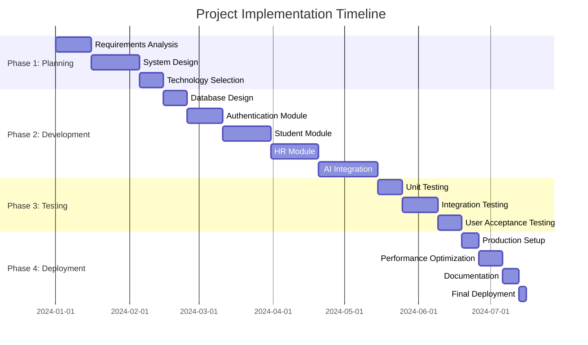

# 07 Implementation Timeline

```mermaid
gantt
    title Project Implementation Timeline
    dateFormat YYYY-MM-DD
    section Phase 1: Planning
    Requirements Analysis           :2024-01-01, 15d
    System Design                   :2024-01-16, 20d
    Technology Selection            :2024-02-05, 10d
    
    section Phase 2: Development
    Database Design                 :2024-02-15, 10d
    Authentication Module           :2024-02-25, 15d
    Student Module                  :2024-03-11, 20d
    HR Module                       :2024-03-31, 20d
    AI Integration                  :2024-04-20, 25d
    
    section Phase 3: Testing
    Unit Testing                    :2024-05-15, 10d
    Integration Testing             :2024-05-25, 15d
    User Acceptance Testing         :2024-06-09, 10d
    
    section Phase 4: Deployment
    Production Setup                :2024-06-19, 7d
    Performance Optimization        :2024-06-26, 10d
    Documentation                   :2024-07-06, 7d
    Final Deployment                :2024-07-13, 3d
```
