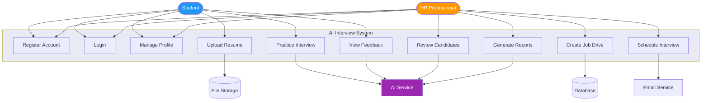

# 08 Use Case Diagram

```mermaid
graph TB
    subgraph System["AI Interview System"]
        UC1[Register Account]
        UC2[Login]
        UC3[Manage Profile]
        UC4[Upload Resume]
        UC5[Practice Interview]
        UC6[View Feedback]
        UC7[Create Job Drive]
        UC8[Schedule Interview]
        UC9[Review Candidates]
        UC10[Generate Reports]
    end
    
    Student([Student]) --> UC1
    Student --> UC2
    Student --> UC3
    Student --> UC4
    Student --> UC5
    Student --> UC6
    
    HR([HR Professional]) --> UC1
    HR --> UC2
    HR --> UC3
    HR --> UC7
    HR --> UC8
    HR --> UC9
    HR --> UC10
    
    UC5 --> AI[AI Service]
    UC6 --> AI
    UC9 --> AI
    UC10 --> AI
    
    UC4 --> Storage[(File Storage)]
    UC7 --> DB[(Database)]
    UC8 --> Email[Email Service]
    
    style Student fill:#2196f3,color:#fff
    style HR fill:#ff9800,color:#fff
    style AI fill:#9c27b0,color:#fff
    style System fill:#e8eaf6
```
