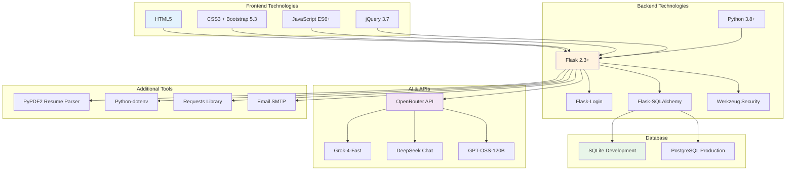

# 09 Technology Stack

```mermaid
graph TB
    subgraph "Frontend Technologies"
        F1[HTML5]
        F2[CSS3 + Bootstrap 5.3]
        F3[JavaScript ES6+]
        F4[jQuery 3.7]
    end
    
    subgraph "Backend Technologies"
        B1[Python 3.8+]
        B2[Flask 2.3+]
        B3[Flask-Login]
        B4[Flask-SQLAlchemy]
        B5[Werkzeug Security]
    end
    
    subgraph "Database"
        D1[SQLite Development]
        D2[PostgreSQL Production]
    end
    
    subgraph "AI & APIs"
        A1[OpenRouter API]
        A2[Grok-4-Fast]
        A3[DeepSeek Chat]
        A4[GPT-OSS-120B]
    end
    
    subgraph "Additional Tools"
        T1[PyPDF2 Resume Parser]
        T2[Python-dotenv]
        T3[Requests Library]
        T4[Email SMTP]
    end
    
    F1 --> B2
    F2 --> B2
    F3 --> B2
    F4 --> B2
    
    B1 --> B2
    B2 --> B3
    B2 --> B4
    B2 --> B5
    
    B4 --> D1
    B4 --> D2
    
    B2 --> A1
    A1 --> A2
    A1 --> A3
    A1 --> A4
    
    B2 --> T1
    B2 --> T2
    B2 --> T3
    B2 --> T4
    
    style F1 fill:#e3f2fd
    style B2 fill:#fff3e0
    style A1 fill:#f3e5f5
    style D1 fill:#e8f5e9
```
