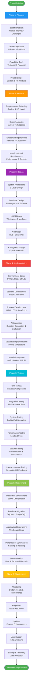

# 01 Complete Sdlc Phases

```mermaid
graph TB
    Start([Project Initiation]) --> P1[Phase 1: Planning]
    
    P1 --> P1A[Identify Problem<br/>Manual Interview Challenges]
    P1A --> P1B[Define Objectives<br/>AI-Powered Solution]
    P1B --> P1C[Feasibility Study<br/>Technical & Financial]
    P1C --> P1D[Project Scope<br/>Student & HR Modules]
    
    P1D --> P2[Phase 2: Analysis]
    
    P2 --> P2A[Requirements Gathering<br/>Student & HR Needs]
    P2A --> P2B[System Analysis<br/>Current vs Proposed]
    P2B --> P2C[Functional Requirements<br/>Features & Capabilities]
    P2C --> P2D[Non-Functional Requirements<br/>Performance & Security]
    
    P2D --> P3[Phase 3: Design]
    
    P3 --> P3A[System Architecture<br/>3-Layer Design]
    P3A --> P3B[Database Design<br/>ER Diagrams & Schema]
    P3B --> P3C[UI/UX Design<br/>Wireframes & Mockups]
    P3C --> P3D[API Design<br/>REST Endpoints]
    P3D --> P3E[AI Integration Design<br/>OpenRouter API]
    
    P3E --> P4[Phase 4: Implementation]
    
    P4 --> P4A[Environment Setup<br/>Python, Flask, SQLite]
    P4A --> P4B[Backend Development<br/>Flask Application]
    P4B --> P4C[Frontend Development<br/>HTML, CSS, JavaScript]
    P4C --> P4D[AI Integration<br/>Question Generation & Evaluation]
    P4D --> P4E[Database Implementation<br/>Models & Migrations]
    P4E --> P4F[Module Integration<br/>Auth, Student, HR, AI]
    
    P4F --> P5[Phase 5: Testing]
    
    P5 --> P5A[Unit Testing<br/>Individual Components]
    P5A --> P5B[Integration Testing<br/>Module Interactions]
    P5B --> P5C[System Testing<br/>End-to-End Scenarios]
    P5C --> P5D[Performance Testing<br/>Load & Stress]
    P5D --> P5E[Security Testing<br/>Authentication & Authorization]
    P5E --> P5F[User Acceptance Testing<br/>Student & HR Feedback]
    
    P5F --> P6[Phase 6: Deployment]
    
    P6 --> P6A[Production Environment<br/>Server Configuration]
    P6A --> P6B[Database Migration<br/>SQLite to PostgreSQL]
    P6B --> P6C[Application Deployment<br/>Web Server Setup]
    P6C --> P6D[Performance Optimization<br/>Caching & Indexing]
    P6D --> P6E[Documentation<br/>User & Technical Manuals]
    
    P6E --> P7[Phase 7: Maintenance]
    
    P7 --> P7A[Monitoring<br/>System Health & Performance]
    P7A --> P7B[Bug Fixes<br/>Issue Resolution]
    P7B --> P7C[Updates<br/>Feature Enhancements]
    P7C --> P7D[User Support<br/>Help & Training]
    P7D --> P7E[Backup & Recovery<br/>Data Protection]
    
    P7E --> End([Continuous Improvement])
    
    style Start fill:#4CAF50,color:#fff
    style P1 fill:#2196F3,color:#fff
    style P2 fill:#FF9800,color:#fff
    style P3 fill:#9C27B0,color:#fff
    style P4 fill:#F44336,color:#fff
    style P5 fill:#00BCD4,color:#fff
    style P6 fill:#8BC34A,color:#fff
    style P7 fill:#FFC107,color:#fff
    style End fill:#4CAF50,color:#fff
```
