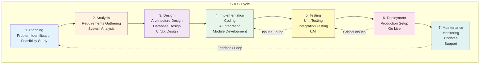

# 02 Sdlc Circular Model

```mermaid
graph TB
    subgraph "SDLC Cycle"
        P1[1. Planning<br/>Problem Identification<br/>Feasibility Study]
        P2[2. Analysis<br/>Requirements Gathering<br/>System Analysis]
        P3[3. Design<br/>Architecture Design<br/>Database Design<br/>UI/UX Design]
        P4[4. Implementation<br/>Coding<br/>AI Integration<br/>Module Development]
        P5[5. Testing<br/>Unit Testing<br/>Integration Testing<br/>UAT]
        P6[6. Deployment<br/>Production Setup<br/>Go Live]
        P7[7. Maintenance<br/>Monitoring<br/>Updates<br/>Support]
    end
    
    P1 --> P2
    P2 --> P3
    P3 --> P4
    P4 --> P5
    P5 --> P6
    P6 --> P7
    P7 -.->|Feedback Loop| P1
    
    P5 -.->|Issues Found| P4
    P6 -.->|Critical Issues| P5
    
    style P1 fill:#E3F2FD
    style P2 fill:#FFF3E0
    style P3 fill:#F3E5F5
    style P4 fill:#E8F5E9
    style P5 fill:#FFF9C4
    style P6 fill:#FCE4EC
    style P7 fill:#E0F2F1
```
