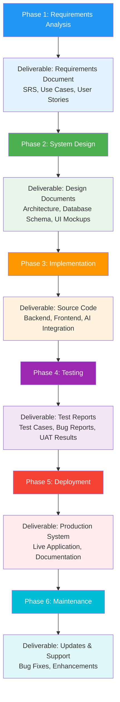

# 03 Waterfall Model

```mermaid
flowchart TD
    P1[Phase 1: Requirements Analysis] --> D1[Deliverable: Requirements Document<br/>SRS, Use Cases, User Stories]
    D1 --> P2[Phase 2: System Design]
    P2 --> D2[Deliverable: Design Documents<br/>Architecture, Database Schema, UI Mockups]
    D2 --> P3[Phase 3: Implementation]
    P3 --> D3[Deliverable: Source Code<br/>Backend, Frontend, AI Integration]
    D3 --> P4[Phase 4: Testing]
    P4 --> D4[Deliverable: Test Reports<br/>Test Cases, Bug Reports, UAT Results]
    D4 --> P5[Phase 5: Deployment]
    P5 --> D5[Deliverable: Production System<br/>Live Application, Documentation]
    D5 --> P6[Phase 6: Maintenance]
    P6 --> D6[Deliverable: Updates & Support<br/>Bug Fixes, Enhancements]
    
    style P1 fill:#2196F3,color:#fff
    style P2 fill:#4CAF50,color:#fff
    style P3 fill:#FF9800,color:#fff
    style P4 fill:#9C27B0,color:#fff
    style P5 fill:#F44336,color:#fff
    style P6 fill:#00BCD4,color:#fff
    
    style D1 fill:#E3F2FD
    style D2 fill:#E8F5E9
    style D3 fill:#FFF3E0
    style D4 fill:#F3E5F5
    style D5 fill:#FFEBEE
    style D6 fill:#E0F7FA
```
