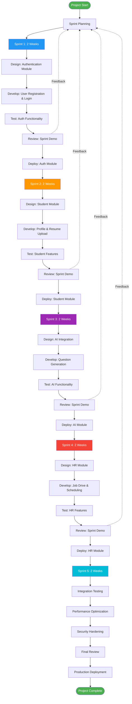

# 04 Agile Sprints

```mermaid
graph TB
    Start([Project Start]) --> Planning[Sprint Planning]
    
    Planning --> Sprint1[Sprint 1: 2 Weeks]
    Sprint1 --> S1A[Design: Authentication Module]
    S1A --> S1B[Develop: User Registration & Login]
    S1B --> S1C[Test: Auth Functionality]
    S1C --> S1D[Review: Sprint Demo]
    S1D --> S1E[Deploy: Auth Module]
    
    S1E --> Sprint2[Sprint 2: 2 Weeks]
    Sprint2 --> S2A[Design: Student Module]
    S2A --> S2B[Develop: Profile & Resume Upload]
    S2B --> S2C[Test: Student Features]
    S2C --> S2D[Review: Sprint Demo]
    S2D --> S2E[Deploy: Student Module]
    
    S2E --> Sprint3[Sprint 3: 2 Weeks]
    Sprint3 --> S3A[Design: AI Integration]
    S3A --> S3B[Develop: Question Generation]
    S3B --> S3C[Test: AI Functionality]
    S3C --> S3D[Review: Sprint Demo]
    S3D --> S3E[Deploy: AI Module]
    
    S3E --> Sprint4[Sprint 4: 2 Weeks]
    Sprint4 --> S4A[Design: HR Module]
    S4A --> S4B[Develop: Job Drive & Scheduling]
    S4B --> S4C[Test: HR Features]
    S4C --> S4D[Review: Sprint Demo]
    S4D --> S4E[Deploy: HR Module]
    
    S4E --> Sprint5[Sprint 5: 2 Weeks]
    Sprint5 --> S5A[Integration Testing]
    S5A --> S5B[Performance Optimization]
    S5B --> S5C[Security Hardening]
    S5C --> S5D[Final Review]
    S5D --> S5E[Production Deployment]
    
    S5E --> End([Project Complete])
    
    S1D -.->|Feedback| Planning
    S2D -.->|Feedback| Planning
    S3D -.->|Feedback| Planning
    S4D -.->|Feedback| Planning
    
    style Start fill:#4CAF50,color:#fff
    style Sprint1 fill:#2196F3,color:#fff
    style Sprint2 fill:#FF9800,color:#fff
    style Sprint3 fill:#9C27B0,color:#fff
    style Sprint4 fill:#F44336,color:#fff
    style Sprint5 fill:#00BCD4,color:#fff
    style End fill:#4CAF50,color:#fff
```
