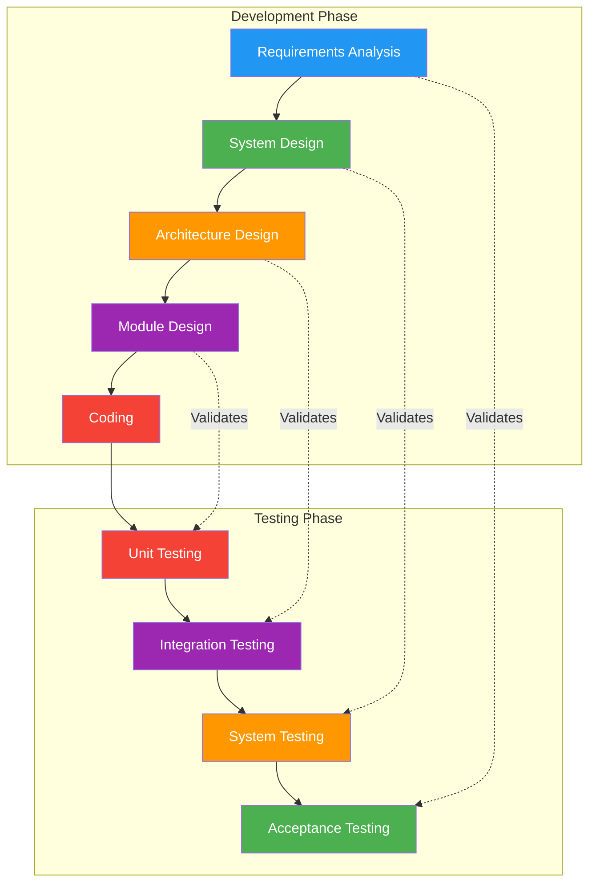

# 05 V Model

```mermaid
graph TB
    subgraph "Development Phase"
        D1[Requirements Analysis]
        D2[System Design]
        D3[Architecture Design]
        D4[Module Design]
        D5[Coding]
    end
    
    subgraph "Testing Phase"
        T1[Acceptance Testing]
        T2[System Testing]
        T3[Integration Testing]
        T4[Unit Testing]
    end
    
    D1 --> D2
    D2 --> D3
    D3 --> D4
    D4 --> D5
    
    D5 --> T4
    T4 --> T3
    T3 --> T2
    T2 --> T1
    
    D1 -.->|Validates| T1
    D2 -.->|Validates| T2
    D3 -.->|Validates| T3
    D4 -.->|Validates| T4
    
    style D1 fill:#2196F3,color:#fff
    style D2 fill:#4CAF50,color:#fff
    style D3 fill:#FF9800,color:#fff
    style D4 fill:#9C27B0,color:#fff
    style D5 fill:#F44336,color:#fff
    
    style T4 fill:#F44336,color:#fff
    style T3 fill:#9C27B0,color:#fff
    style T2 fill:#FF9800,color:#fff
    style T1 fill:#4CAF50,color:#fff
```
