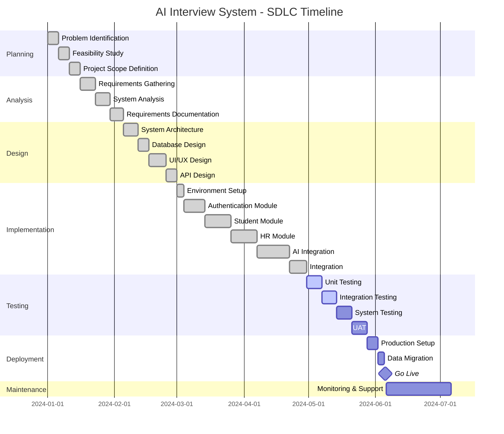

# 06 Project Timeline

```mermaid
gantt
    title AI Interview System - SDLC Timeline
    dateFormat YYYY-MM-DD
    
    section Planning
    Problem Identification           :done, p1, 2024-01-01, 5d
    Feasibility Study               :done, p2, 2024-01-06, 5d
    Project Scope Definition        :done, p3, 2024-01-11, 5d
    
    section Analysis
    Requirements Gathering          :done, a1, 2024-01-16, 7d
    System Analysis                 :done, a2, 2024-01-23, 7d
    Requirements Documentation      :done, a3, 2024-01-30, 6d
    
    section Design
    System Architecture             :done, d1, 2024-02-05, 7d
    Database Design                 :done, d2, 2024-02-12, 5d
    UI/UX Design                    :done, d3, 2024-02-17, 8d
    API Design                      :done, d4, 2024-02-25, 5d
    
    section Implementation
    Environment Setup               :done, i1, 2024-03-01, 3d
    Authentication Module           :done, i2, 2024-03-04, 10d
    Student Module                  :done, i3, 2024-03-14, 12d
    HR Module                       :done, i4, 2024-03-26, 12d
    AI Integration                  :done, i5, 2024-04-07, 15d
    Integration                     :done, i6, 2024-04-22, 8d
    
    section Testing
    Unit Testing                    :active, t1, 2024-04-30, 7d
    Integration Testing             :active, t2, 2024-05-07, 7d
    System Testing                  :t3, 2024-05-14, 7d
    UAT                            :t4, 2024-05-21, 7d
    
    section Deployment
    Production Setup                :t5, 2024-05-28, 5d
    Data Migration                  :t6, 2024-06-02, 3d
    Go Live                        :milestone, t7, 2024-06-05, 1d
    
    section Maintenance
    Monitoring & Support            :t8, 2024-06-06, 30d
```
