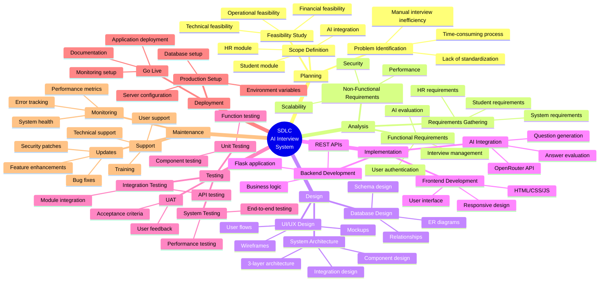

# 07 Sdlc Activities Mindmap

```mermaid
mindmap
  root((SDLC<br/>AI Interview<br/>System))
    Planning
      Problem Identification
        Manual interview inefficiency
        Time-consuming process
        Lack of standardization
      Feasibility Study
        Technical feasibility
        Financial feasibility
        Operational feasibility
      Scope Definition
        Student module
        HR module
        AI integration
    Analysis
      Requirements Gathering
        Student requirements
        HR requirements
        System requirements
      Functional Requirements
        User authentication
        Interview management
        AI evaluation
      Non-Functional Requirements
        Performance
        Security
        Scalability
    Design
      System Architecture
        3-layer architecture
        Component design
        Integration design
      Database Design
        ER diagrams
        Schema design
        Relationships
      UI/UX Design
        Wireframes
        Mockups
        User flows
    Implementation
      Backend Development
        Flask application
        REST APIs
        Business logic
      Frontend Development
        HTML/CSS/JS
        Responsive design
        User interface
      AI Integration
        OpenRouter API
        Question generation
        Answer evaluation
    Testing
      Unit Testing
        Component testing
        Function testing
      Integration Testing
        Module integration
        API testing
      System Testing
        End-to-end testing
        Performance testing
      UAT
        User feedback
        Acceptance criteria
    Deployment
      Production Setup
        Server configuration
        Database setup
        Environment variables
      Go Live
        Application deployment
        Monitoring setup
        Documentation
    Maintenance
      Monitoring
        System health
        Performance metrics
        Error tracking
      Updates
        Bug fixes
        Feature enhancements
        Security patches
      Support
        User support
        Technical support
        Training
```
